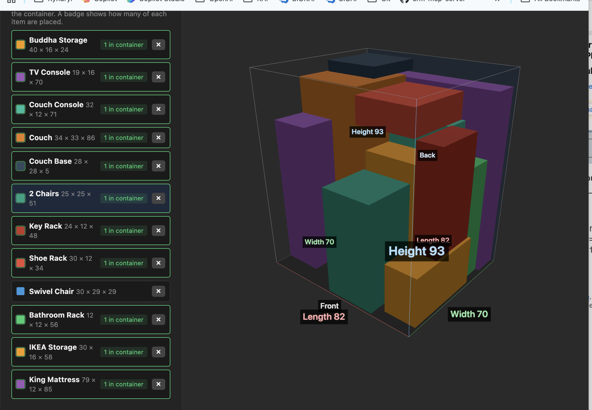

# Cargo Space Visualizer

A simple 3D web app for planning how to load a moving container. Define your container and items, drag them into a 3D view, adjust placement, and export a numbered loading plan.

No build step — plain HTML, CSS, and JavaScript with [Three.js](https://threejs.org/) loaded from a CDN.

**Live app:** [https://tejendra.github.io/cargo-space-visualizer/](https://tejendra.github.io/cargo-space-visualizer/)



## Running locally

ES modules require a local web server (opening `index.html` directly in the browser will not work).

From the project directory:

```bash
python3 -m http.server 8080
```

Then open [http://localhost:8080](http://localhost:8080).

Alternatives:

```bash
npx serve .
# or
php -S localhost:8080
```

## Quick start

1. Set **container** length, width, and height, then click **Update container**.
2. **Create items** with a name and dimensions (length × width × height). Use **↻ X / Y / Z** to pick an orientation before adding to the library.
3. Click a **library item** to select it, rotate if needed, then **drag it onto the 3D view**.
4. Use **arrow keys** to nudge the selected item into place (←→ along length, ↑↓ along width). Hold **Shift** for fine steps.
5. **Export loading plan** when you are ready for a numbered load sequence.

Units are arbitrary — pick one (feet, inches, cm) and use it consistently.

## Features

### Container

- Set custom container dimensions
- Color-coded axis labels (length, width, height)
- Blue **back wall** and **Front / Back** labels so orientation is clear
- Default camera view from the **front door**, zoomed to show the front opening and top edge
- Orbit controls: drag to rotate the view, scroll to zoom

### Items

- Create an **item library** with name, dimensions, and color
- Rotate items in **90° steps** on any axis (↻ X, ↻ Y, ↻ Z) — upright, on the floor, or on any side
- Rotate before adding to the library, while selected in the library, while dragging (X/Y/Z keys), or after placement
- Drag library items into the container (multiple copies of the same item are supported)
- **Badge** on library items showing how many copies are placed
- Remove items from the library with **×**

### Placement and physics

- Items drop onto the canvas at the cursor; gravity settles them when possible
- Items cannot float; stacked items sit directly on the floor or on items below
- **Orange glow** on items that overlap, extend outside the container, or lack support
- Click to select a placed item; drag to move; **Remove** to delete
- Arrow-key nudging for precise positioning

### Export and persistence

- **Auto-save** to browser local storage (layout restores on refresh)
- **Export layout** — JSON backup of container, library, and all placed items
- **Import layout** — restore a saved JSON file (replaces the current layout)
- **Export loading plan** — text plan with:
  - Numbered load order (bottom first, back to front, left to right when facing the door)
  - Item dimensions and orientation (upright, on side, rotated on floor)
  - Location (front/back, left/right from the door, floor or height)
  - Stacking notes (on floor or stacked on other items)

### Other

- **Clear placed items** — remove everything in the container, keep the library
- **Reset everything** — wipe container, library, placed items, and saved data

## Project structure

```
index.html   UI and Three.js import map
style.css    Layout and panel styles
app.js       3D scene, placement logic, save/load, exports
```

## Browser notes

- Requires a modern browser with ES module and localStorage support
- Three.js is fetched from jsDelivr on first load (network required)
- Layout JSON exports can be moved between browsers or devices; local storage is per browser on the same machine
